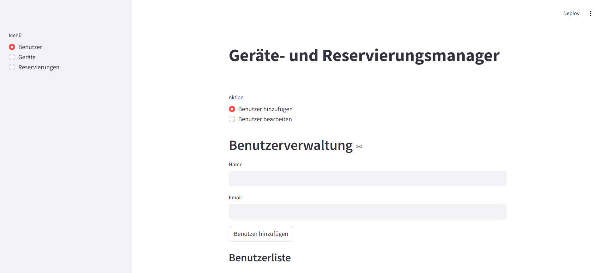

# Geräteverwaltung

Programm zur Verwaltung von Geräten an Hochschulen

## Installation

- Python version 3.12.7
- pip install streamlit
- pip install tinydb 3.15.2
- or just import reqirements.txt

Screenshot zu Abgabe 1:

